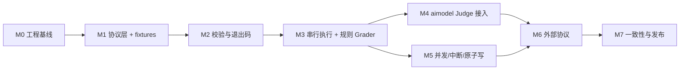

# EvalExec 分阶段开发规划

本文基于 `agent-eval/evalexec/` 下的四份设计稿（`01-research.md`、`02-core-spec.md`、`03-cli-and-execution.md`、`04-mvp-scope.md`）整理，面向本仓库的落地开发。

技术方案：**Go 实现**，LLM Judge 调用统一对接 [`github.com/vogo/aimodel`](https://github.com/vogo/aimodel)。

设计的核心约束不在本文重复论证，只作为实现前提：

> 一次进程调用 = 一个 `EvalRequest` → 一个 Grader → 一个 `EvalResult`。不执行被评 Agent，不解释分数，不做编排。

---

## 1. 设计要点归纳（实现视角）

把设计稿翻译成对代码结构有约束力的事实：

| 维度 | 结论 | 对实现的约束 |
|---|---|---|
| 入口 | `evalexec [flags]`，无子命令 | 单个 `cmd/evalexec`，无子命令树；参数解析层要能表达"`--grader` 重复即报错" |
| 输入 | `EvalRequest`（CLI flags + 可选 `--request` 文件，flags 覆盖文件） | 需要"合并 → 规范化 → 快照"三步管线，快照要脱敏 |
| 输出 | 结果目录：`result.json` + `records.jsonl` + `checksums.sha256`（+ 可选 `errors.jsonl`、`logs/`） | 目录整体原子发布，禁止半成品目录被观察到 |
| 校验 | 6 步固定顺序，必须全部先于首次 Grader/Judge 调用 | 校验必须是独立于执行的一遍完整扫描 → 数据集要读两遍 |
| 一致性 | `records.jsonl` 行数恒等于数据集行数 | 停止路径也必须读完剩余数据集拿 `case_id`/`sequence` 来补写 `skipped` |
| 状态 | 运行级 `completed/cancelled/failed`；样本级 `completed/skipped`；评估级 `success/fail` | 三层状态必须是三个独立枚举类型，不能混用一个字符串 |
| 退出码 | `0`/`2`/`3`/`4`/`130`，只表达命令是否执行成功 | 退出码集中在一处映射，禁止各处直接 `os.Exit` |
| Judge | 三种协议：`openai-chat`/`http-json`/`stdio-jsonl` | **全部收敛到 aimodel 的 `ChatCompleter` 单一接口**，见 §2 |
| Grader | 三种协议：`builtin`/`http-json`/`stdio-jsonl` | Grader 接口 + 按协议注册的工厂 |
| 语言无关 | 协议优先于 SDK，Python/Go 需通过同一组 fixtures | fixtures 放在仓库内、与实现解耦 |

### 1.1 交付形态：二进制 + 可复用库

本项目有两个平级的交付物，**不使用 `internal/`**：

1. **二进制**：`evalexec` 命令，设计稿定义的原子 CLI；
2. **Go 库**：`github.com/sequencestream/evalexec` 及其子包，供其他项目直接 import —— 复用协议类型、实现自定义 Grader、或把评估执行嵌入自己的编排器。

代价要提前认账：**所有包都在公开 API 面上，改一次导出标识符就是一次破坏性变更**。应对办法不是把代码藏进 `internal/`，而是分层声明稳定性承诺（§1.3）并在 CI 里用 `gorelease` 卡住（M0）。

### 1.2 目录与包划分

```text
github.com/sequencestream/evalexec
├── evalexec.go              # 根包门面：Run(ctx, *evalspec.EvalRequest, ...Option) (*evalspec.EvalResult, error)
├── cmd/evalexec/            # main：解析 → 调用根包 Run → 退出码，无业务逻辑
├── evalspec/                # 协议类型：EvalRequest/EvalResult/Session/Record，spec_version 常量
├── grader/                  # Grader 接口 + Declaration + GradeCall + registry
│   ├── builtin/             # exact_match / contains / regex / json_schema / llm_judge
│   ├── httpjson/            # protocol=http-json
│   └── stdiojsonl/          # protocol=stdio-jsonl
├── judge/                   # Judge 接口；judge_model 配置 → aimodel Client 的装配
│   ├── transport/           # 记录原始请求/响应的 RoundTripper（logs/ 与脱敏）
│   └── provider/            # 自定义 ais.ChatProvider：http-json / stdio-jsonl
├── dataset/                 # Session JSONL 流式 reader、case_id 唯一索引、两遍扫描
├── validate/                # 6 步前置校验，产出结构化 ValidationError
├── runner/                  # 派发、并发窗口、超时、fail-fast、中断、skipped 补写
├── summary/                 # 计数恒等式与 score 统计
├── result/                  # 结果目录：临时目录、顺序写入、checksums、原子 rename 发布
├── redact/                  # 请求快照脱敏（auth 只留 env 名）
├── exitcode/                # 错误 → 退出码的唯一映射点
├── cli/                     # flag 定义、--request 合并、key=value 覆盖、参数级错误
├── version/                 # ldflags 注入点，供 provenance.implementation 使用
├── fixtures/                # 跨语言协议 fixtures + embed.FS（见 §1.4）
└── doc/dev-plan.md
```

命名说明：

- **`evalspec` 而不是 `spec`**：`spec` 在下游文件里几乎必然与别的包重名，被迫起别名。`evalspec.EvalResult` 在调用点自解释。
- **根包门面 `Run`**：库的主用法应该和 CLI 一样是一次原子调用，而不是让调用方自己拼 `dataset` + `runner` + `summary` + `result` 四个包。子包只服务于扩展与替换。
- **`result` 而不是 `output`**：`output` 太泛；这个包的职责就是"写出 EvalResult 结果目录"。

### 1.3 API 稳定性分层

每个包的 `doc.go` 顶部必须写明自己属于哪一层，并在 README 里给出同一张表：

| 层 | 包 | 承诺 |
|---|---|---|
| **L1 协议** | `evalspec`、`fixtures` | 与 `spec_version` 同生命周期。`evalexec/v1alpha1` 内只增可选字段；删字段/改类型/改状态含义 = 提规范版本 + 提 major |
| **L2 扩展点** | 根包 `Run`、`grader`、`judge` | v1.0 后遵守 Go 兼容性承诺。接口只增方法 = 破坏性变更，因此**接口一开始就要收窄**（`Grader` 只有两个方法，`Judge` 只有一个） |
| **L3 组件** | `dataset`、`validate`、`runner`、`summary`、`result`、`exitcode`、`redact` | v0 期间可变更，v1.0 起遵守兼容性承诺；变更走 CHANGELOG |
| **L4 实现细节** | `cli` | **不承诺兼容**，`doc.go` 明写"服务于 cmd/evalexec，随时可能变更"。虽然公开，但不建议下游依赖 |

用 `internal/` 的收益在这个项目里很小 —— 真正不该被依赖的只有 `cli` 一个包，靠文档声明足够；用 L4 标注换来的是整套代码对外可读、可复用。

### 1.4 fixtures 作为公开资产

协议 fixtures 是"Python 与 Go 实现通过同一组用例"这条验收标准的载体，因此**不放 `testdata/`，放 `fixtures/`**：

- Go 下游：`fixtures.FS`（`//go:embed all:data`）直接取用，可用于自测自己实现的 Grader；
- 其他语言：仓库路径稳定，`git clone` 或 release 附件即可获取；
- 目录名不叫 `testdata`，避免被 `go test ./...` 的包匹配规则和各种工具链特殊对待。

### 1.5 贯穿全程的工程约定

- **错误模型先于功能**：所有内部错误实现带 `Kind`（`argument`/`precheck`/`output`/`runtime`/`interrupt`）的接口，`exitcode` 包做唯一映射。**只有 `cmd/evalexec` 调用 `os.Exit`**；库路径一律返回 error，否则 evalexec 作为库被嵌入时会直接杀掉宿主进程。
- **stdout 保持干净**：进度与诊断一律写 stderr，结果只落文件。库路径的诊断输出走可注入的 `io.Writer`（默认 `io.Discard`），不硬编码 `os.Stderr`。
- **信号处理只在 main**：`signal.Notify` 属于 `cmd/evalexec`；`runner` 只认 `context.Context` 的取消。库调用方用自己的 ctx 控制中断。
- **绝不输出密钥**：`judge_model.auth` 在请求快照中只保留 `{"type":"bearer_env","env":"..."}`。CI 增加一条检查：对 fixtures 跑一遍结果目录扫描，断言不含预置的假密钥串。
- **时间与 ID 可注入**：`Clock` 与 `IDGenerator` 依赖注入，否则黄金文件测试无法稳定比对。`eval_id` 默认 UUIDv7。
- **依赖极简**：aimodel 本身零外部依赖；evalexec 的直接依赖控制在 aimodel + 一个 JSON Schema 库以内。
- **术语边界**：评分组件一律称 **Grader**（协议字段 `grader`、`grader_id`、`grader_version`；CLI `--grader`、`--grader-param`；包名 `grader`）。表示"一次评估运行"的 `evaluation`、`eval_id`、`EvalRequest`、`EvalResult`、`spec_version` 保持不变。代码里**不得再出现 `evaluator` 词根** —— 加一条 lint 或 CI grep 守住这条线。公开 API 上的词根写错，改名就是破坏性变更。
- **公开类型自带不变量校验**：下游可以直接构造 `evalspec` 里的结构体，"只有我们的代码会构造它"这个假设不再成立。凡是有不变量的类型（`fail` 时 `score` 必须为 `nil`、`skipped` 时 `evaluation` 必须为 `nil`、计数恒等式）都要提供受控构造函数 + `Validate() error`，并在写出前统一调用一次。
- **每阶段都能跑通端到端**：从 M2 起 `evalexec` 始终是一个可运行命令，只是能力边界不同。

---

## 2. 技术选型与 aimodel 对接方案

> **版本基准：aimodel `v0.5.0`**（M0 核对定稿，见 `doc/design/M0-baseline.md` §2）。
> v0.4.1 是单包扁平布局，没有 provider 注册扩展点，§2.3 的方案在其上无法实现；
> v0.5.0 的「provider 子包化 + 注册式分发」重构恰好提供了本节假设的全部结构。

### 2.1 为什么用 aimodel

| 需求 | aimodel 的对应能力 |
|---|---|
| Judge 走 OpenAI 兼容端点 | `provider/openai`（默认 provider，`Name = "openai"`） |
| Judge 走 Anthropic Messages | `provider/anthropic`（`Name = "anthropic"`），**规范未覆盖，属于免费获得的能力** |
| 统一 token 用量口径 | `ais.Usage`（`PromptTokens`/`CompletionTokens`/`TotalTokens`/`CacheReadTokens`/`ReasoningTokens`）+ `Usage.Add()` |
| 结构化输出 | `ais.ChatRequest.ResponseFormat any` / `Tools` + `ToolChoice` |
| 自定义协议接入 | `ais.ChatProvider` 接口 + `ais.Register(name, factory)` |
| 不引入不需要的东西 | aimodel 明确不做重试、限流、缓存、指标 —— 与 EvalExec "失败即 `fail`，不隐藏、不重试"的语义完全一致 |

模块路径 `github.com/vogo/aimodel`，**要求 Go 1.26**，零外部依赖。

关键 API（本项目实际会用到的全部）：

```go
import (
    "github.com/vogo/aimodel"
    "github.com/vogo/aimodel/ais"
    "github.com/vogo/aimodel/provider/openai"    // 取 openai.Name
    // provider/anthropic 由根包 client.go 空白 import 自动注册，无需显式引入
)

client, err := aimodel.NewClient(
    aimodel.WithProvider(openai.Name),      // 或 anthropic.Name / 自定义名
    aimodel.WithAPIKey(key),                // 显式传，绝不依赖环境变量兜底
    aimodel.WithBaseURL(endpoint),          // openai provider 必填，缺省返回 ais.ErrNoBaseURL
    aimodel.WithHTTPClient(tunedClient),    // 并发调优 + 原始请求响应记录
    aimodel.WithTimeout(d),                 // 兜底超时，单次超时仍用 ctx
)

resp, err := client.ChatCompletion(ctx, &ais.ChatRequest{...})  // resp.Choices / resp.Usage
```

`aimodel.Client` 构造后字段不可变（`model` / `httpClient` / `provider`），可安全地在所有 worker 间共享一个实例。

两处易错点（M0 核对源码后补充）：

- `WithDefaultModel` **只在 `ChatRequest.Model` 为空时兜底**。本项目始终显式设 `req.Model`，兜底路径永不生效，因此不使用该 Option。
- `NewClient` 末尾执行 `httpClient.Timeout = cfg.timeout`，会**改写调用方传入的 `*http.Client`**。故每个 aimodel client 必须配一个独立的 `*http.Client` 实例，不得跨 client 共享，否则超时会互相覆盖。另外 `WithHTTPClient(nil)` 直接 panic。

### 2.2 `judge_model` 配置 → aimodel 的映射

设计稿的 `judge_model` 结构直接对应 aimodel 的构造参数：

| `judge_model` 字段 | aimodel 映射 |
|---|---|
| `protocol: "openai-chat"` | `WithProvider(openai.Name)` |
| `protocol: "anthropic-messages"`（**建议新增**） | `WithProvider(anthropic.Name)` |
| `protocol: "http-json"` | `WithProvider("http-json")` —— 自建 `ais.ChatProvider`，见 §2.3 |
| `protocol: "stdio-jsonl"` | `WithProvider("stdio-jsonl")` —— 自建 provider + 子进程 RoundTripper |
| `endpoint` | `WithBaseURL(endpoint)` |
| `auth: {type: bearer_env, env: X}` | `WithAPIKey(os.Getenv(X))` |
| `timeout_ms` | 每次调用 `context.WithTimeout`；同时 `WithTimeout` 作为兜底 |
| `parameters.model` | `ais.ChatRequest.Model` |
| `parameters.temperature` | `ais.ChatRequest.Temperature`（`*float64`） |
| `parameters.max_completion_tokens` | `ais.ChatRequest.MaxCompletionTokens`（优先于已弃用的 `MaxTokens`） |
| `parameters.top_p` / `top_k` / `stop` / `reasoning_effort` / `parallel_tool_calls` / `response_format` | 同名字段直通 |
| `parameters` 中的未知键 | 直接报参数错误，不静默丢弃 |

v0.5.0 把 canonical 字段收窄为「≥2 个 provider 共有」，删掉了 `seed`、`n`、`frequency_penalty`、`presence_penalty`、`user`、`verbosity`、`logprobs`、`logit_bias`、`service_tier`、`store`、`metadata`、`prompt_cache_key` 等。因此上表就是 `judge_model.parameters` 的**完整白名单（10 个键）**：`model`、`temperature`、`max_completion_tokens`、`max_tokens`、`top_p`、`top_k`、`stop`、`reasoning_effort`、`parallel_tool_calls`、`response_format`。其余键一律参数错误（退出码 `2`）。

**必须显式传参、不得依赖 aimodel 的环境变量兜底。** `NewClient` 在应用 Option 之前会依次读 `AI_API_KEY`/`OPENAI_API_KEY`/`ANTHROPIC_API_KEY`、`AI_BASE_URL`/… 和 `AI_MODEL`。若 `auth.env` 指向的变量为空，正确行为是**前置校验失败（退出码 2）**，而不是让 aimodel 悄悄用上另一个环境里的 key —— 那会让 `provenance` 记录的配置与实际调用的服务不一致。因此：

1. `judge` 包自己读 `auth.env`，为空即报 precheck 错误；
2. 始终显式调用 `WithAPIKey` / `WithBaseURL` / 设置 `req.Model`，让兜底路径永不生效；
3. 本地无鉴权的 Judge 端点仍需一个占位 key（`NewClient` 对空 key 返回 `ais.ErrNoAPIKey`），约定用 `auth: {"type":"none"}` 时内部填 `"-"`。

### 2.3 用 `ais.ChatProvider` 统一三种 Judge 协议

设计稿要求 Judge 支持 `openai-chat` / `http-json` / `stdio-jsonl` 三种协议。与其在 `judge` 包里写三套调用逻辑，不如把后两种**实现成 aimodel 的自定义 provider**：

```go
type ChatProvider interface {
    NewChatRequest(ctx context.Context, req *ais.ChatRequest) (*http.Request, error)
    ParseChatResponse(body io.Reader) (*ais.ChatResponse, error)
    ParseErrorResponse(statusCode int, body []byte) error
    NewStreamDecoder(body io.Reader) ais.StreamDecoder
}
```

- **`http-json`**：`NewChatRequest` 序列化 EvalExec 约定的标准请求体、`ParseChatResponse` 解析标准响应并填 `Usage`。
- **`stdio-jsonl`**：provider 照常构造一个 `*http.Request`（URL 用 `stdio://local` 占位），真正的传输由 `WithHTTPClient` 注入的**自定义 `http.RoundTripper`** 完成——它把请求体作为一行 JSON 写进子进程 stdin，读回一行作为响应体。子进程 stderr 落 `logs/`。
- `NewStreamDecoder` 返回一个永远 `io.EOF` 的 decoder：EvalExec 不使用流式。

**每次运行的配置怎么传给 provider**（M0 核对后定稿）：`ais.Register` 对**重名直接 panic**（源码注释明确「重名是编程错误，静默覆盖会让分发依赖 import 顺序」），因此 `http-json` / `stdio-jsonl` 只能在 `init()` 里各注册**一次**，不能「每次评估注册一个带该次配置的 provider」。单次运行的 endpoint、子进程命令、超时等，一律通过 `aimodel.WithProviderOptions(...)` 传入，由工厂签名 `func(cfg ais.Config) (ais.ChatProvider, error)` 的 `cfg.Options` 接收；工厂必须拒绝不认识的 Options 类型。

收益：`judge` 包对上只暴露一个 `aimodel.ChatCompleter`，`llm_judge` Grader 完全不感知协议差异；三种协议共享同一套超时、用量统计、错误分类和日志记录代码。

### 2.4 用量、错误与超时映射

**用量**（`ais.Usage` → EvalExec）：

| EvalExec 字段 | 来源 |
|---|---|
| `evaluation.usage.judge_input_tokens` | `resp.Usage.PromptTokens` |
| `evaluation.usage.judge_output_tokens` | `resp.Usage.CompletionTokens` |
| `evaluation.usage.judge_cache_read_tokens`（**建议新增可选字段**） | `resp.Usage.CacheReadTokens` |
| `evaluation.usage.judge_reasoning_tokens`（**建议新增可选字段**） | `resp.Usage.ReasoningTokens` |
| `result.usage.judge_model.*` | 用 `ais.Usage.Add()` 累加后一次性映射 |

`v1alpha1` 允许增加可选字段，因此后两项不构成破坏性变更；推理模型的思考 token 若不单列，用量汇总会与账单对不上。

**错误分类**（aimodel 错误 → `evaluation.error.code`）：

| aimodel 返回 | `error.code` |
|---|---|
| `*ais.APIError`（非 2xx，含 `StatusCode`/`Code`/`Type`） | `judge_error` |
| `ais.ErrEmptyResponse`（无 choices） | `judge_error` |
| `errors.Is(err, context.DeadlineExceeded)` | `timeout` |
| `errors.Is(err, context.Canceled)` | 不写 `fail`，该样本按 `skipped` 处理 |
| 网络/传输错误（`*url.Error` 等） | `judge_error` |
| 响应正常但 Judge 文本不是合法 JSON / 缺 `score` 字段 | `protocol_error` |
| Judge 明确表示证据不足 | `insufficient_evidence` |
| Grader 内部 panic（recover 捕获） | `internal_error` |

`*ais.APIError` 的 `StatusCode` 与 `Code` 应写入 `evaluation.error.message`，但**不得**写入响应体原文（可能含 prompt 回显）；原文只进 `logs/`。

**超时**：aimodel 的 `WithTimeout` 作用于 `http.Client`，是客户端级的；EvalExec 的 `judge_model.timeout_ms` 是每次调用级的，必须用 `context.WithTimeout` 实现。两级并存：`ctx` 控制单次调用，`WithTimeout` 设为 `timeout_ms` 的 2 倍作为兜底。Grader 级的 `grader.timeout_ms` 是更外层的第三级 context。

**取消语义**：`context.Canceled` 与 `DeadlineExceeded` 必须严格区分 —— 前者是 fail-fast/中断导致的取消，样本记 `skipped`；后者是超时，样本记 `completed` + `fail` + `timeout`。用 `errors.Is` 判断，不能只看 `ctx.Err()`。

### 2.5 并发与传输调优

EvalExec 的 `--concurrency` 会让多个 worker 同时调用同一个 `aimodel.Client`。默认 `http.Transport` 的 `MaxIdleConnsPerHost` 是 2，高并发下会不断新建 TLS 连接，实测会成为主要延迟来源。因此 `judge` 包必须自建 `http.Client`：

```go
tr := http.DefaultTransport.(*http.Transport).Clone()
tr.MaxIdleConns        = concurrency * 2
tr.MaxIdleConnsPerHost = concurrency
tr.MaxConnsPerHost     = concurrency
```

再叠加一层记录用的 `RoundTripper`（§2.6），通过 `aimodel.WithHTTPClient` 注入。

aimodel 不做重试与限流，这与 EvalExec 的语义一致（一次失败即 `fail`，不隐藏）。但需要在 README 明确：**429 / 5xx 不会自动重试**，被计为 `judge_error`；如需重试，由上层编排器重跑整个评估。

### 2.6 原始请求响应记录与脱敏

aimodel 只对流式提供 `InterceptStream`，非流式没有拦截点。因此在 `WithHTTPClient` 的 `RoundTripper` 层做记录：

- 请求体、响应体、状态码、耗时写入 `logs/judge-<case_id>.jsonl`（仅在 `--debug` 或该样本 `fail` 时保留）；
- `Authorization` 头在记录前替换为 `Bearer ***`；
- 记录不进入 `checksums.sha256`，也不进入 `result.json`。

这同时解决了 M4 里"Judge 返回非结构化文本导致 `protocol_error` 难以排查"的问题。

### 2.7 aimodel 的能力缺口

| 缺口 | 影响 | 处理 |
|---|---|---|
| `ais.ChatRequest` **没有 `seed` 字段**（v0.5.0 核对确认：canonical 层收窄时移除） | 设计稿的 `--seed` 无法透传给 Judge | 定稿为：`seed` 不透传给 Judge，只作为 EvalExec 自身的确定性参数记录进 `provenance`；`llm_judge` 用 `temperature=0` 求稳。若后续必须支持，走 `ais.Extensions` 通道或向 aimodel 提 issue |
| `ResponseFormat` 是 `any`，跨 provider 语义不统一 | OpenAI 用 `json_schema`，Anthropic 需走 tool 或 output config，**而 DeepSeek 直接返回 400 `This response_format type is unavailable now`**（M4 实测） | 定稿为**默认不发送**，由 `llm_judge` 的 `structured_output: bool` 参数显式开启。原方案"优先 ResponseFormat、失败回退"在 EvalExec 里行不通：回退需要重试，而"不重试"是明确边界，一次被拒的请求就是丢掉整个样本。prompt 里约定 JSON + 容错解析在所有 provider 上都有效，因此它是默认路径 |
| 无重试 / 无限流 | 高并发打到限流会大量 `judge_error` | 明确为非目标，写进 README；`--concurrency` 默认 1 |
| 仓库较新，canonical 层可能演进 | 升级可能破坏编译 | go.mod 钉死精确版本；`judge` 包是唯一 import aimodel 的地方，把爆炸半径限制在一个包内 |
| `NewClient` 拒绝空 API key | 本地无鉴权 Judge 无法直连 | 约定 `auth.type = "none"` 时内部填占位 key |

---

## 3. 里程碑总览



| 里程碑 | 对应设计稿阶段 | 目标 | 粗估 |
|---|---|---|---:|
| M0 | — | 仓库骨架、CI 基线、aimodel 依赖打通、API 守卫 | 1.5 人日 |
| M1 | S1 协议 | `evalspec` 公开类型、构造函数与 Validate、fixtures 包 | 2.5 人日 |
| M2 | S1/S4 前移 | 参数、6 步校验、退出码、原子目录 | 2 人日 |
| M3 | S2 + S3 前半 | 串行跑通 + 4 个规则 Grader + 注册表 + 根包 `Run` | 3.5 人日 |
| M4 | S3 后半 | aimodel Judge 封装 + `llm_judge` + 全部 `error.code` | 3 人日 |
| M5 | S4 工程化 | 并发、超时、fail-fast、中断、skipped 补写 | 3 人日 |
| M6 | S5 互操作 | 自定义 `ais.ChatProvider` + 外部 Grader 协议 | 3.5 人日 |
| M7 | — | 契约测试、跨语言验证、二进制与库双发布 | 2.5 人日 |

M4 与 M5 无强依赖，可并行；M5 的 `skipped` 补写测试用规则 Grader 构造失败即可，不必等 M4。

---

## 4. 各阶段详细规划

### M0 工程基线

**交付物**

- `go.mod`：`module github.com/sequencestream/evalexec`，`go 1.26`（aimodel 的最低要求），`require github.com/vogo/aimodel <pinned>`
- `Makefile`（`build`/`test`/`lint`/`apidiff`/`fixtures`）、`.golangci.yml`
- `cmd/evalexec/main.go` 骨架：打印版本即退出
- **每个包一个 `doc.go`**，首段写包职责，末段写稳定性层级（L1–L4，§1.3）
- **API 兼容性守卫**：CI 跑 `golang.org/x/exp/cmd/gorelease`，对比上一个 tag 报告破坏性变更；v0 期间只警告，v1.0 起变成硬失败
- **词根守卫**：CI grep 断言全仓库无 `evaluator`（§1.5 术语边界）
- **aimodel 连通性冒烟测试**：一个 `//go:build e2e` 的测试，用真实 key 打一次 `ChatCompletion`，默认不在 CI 跑
- GitHub Actions：`go vet` + `golangci-lint` + `go test -race ./...`
- 版本信息通过 `-ldflags` 注入，供 `provenance.implementation.version` 使用

**DoD**：`make build && make test` 在干净环境通过；`evalexec --version` 输出与 git tag 一致；`go list -m all` 只有 aimodel 一个非标准库直接依赖；`gorelease` 能跑通并输出报告。

---

### M1 协议层与 fixtures（对应 S1）

**目标**：把 `02-core-spec.md` 变成可编译、可往返的 Go 类型，并产出跨语言共享的 fixtures。

**交付物**

- `evalspec`：
  - `EvalRequest`、`Dataset`、`GraderSpec`、`JudgeModelSpec`、`Execution`
  - `Session`（`case_id`/`input`/`output`/`trajectory`/`reference`/`context`/`criteria`/`metadata`）
  - `Record`、`Evaluation`、`EvalError`、`Usage`
  - `EvalResult`、`Counts`、`EvaluationSummary`、`ScoreStats`、`Provenance`
  - 三个状态枚举：`RunStatus`、`RecordStatus`、`EvaluationStatus`；`StopReason`、`ErrorCode`
  - 常量 `SpecVersion = "evalexec/v1alpha1"`
- 编解码规则：
  - 未识别字段忽略（默认 `encoding/json` 行为，不启用 `DisallowUnknownFields`）
  - `output` 必须能区分"键不存在"与"值为 null" → `json.RawMessage` 或 `*T` + 显式 present 标志
  - 时间统一 RFC 3339 UTC；`latency_ms`/`duration_ms` 为整数毫秒
  - `score` 为 `*float64`，`fail` 时强制 `nil`
- **公开 API 该有的东西**（`evalspec` 是 L1，下游会直接构造这些类型）：
  - 受控构造函数：`NewSuccessEvaluation`、`NewFailEvaluation`（强制 `score = nil`）、`NewSkippedRecord`
  - `Validate() error`：`EvalRequest`、`Record`、`EvalResult` 各一个，覆盖各自的不变量
  - 枚举用具名类型 + `IsValid()`，禁止裸 `string`
  - `Example_*` 测试：既是 pkg.go.dev 上的文档，也是 API 可用性的第一个使用者
- `fixtures/`：`data/` 放用例，`fixtures.go` 用 `//go:embed all:data` 导出 `FS`
- `fixtures/data/`：至少 6 组，每组 `request.json` + `dataset.jsonl` + `expected/result.json` + `expected/records.jsonl`
  - `f01-exact-match-all-pass`
  - `f02-mixed-success-fail`（覆盖 `insufficient_evidence`）
  - `f03-llm-judge-basic`（Judge 用录制响应）
  - `f04-fail-fast-cancelled`
  - `f05-interrupt-cancelled`
  - `f06-precheck-failures`（每个校验步骤一个子用例，只断言退出码与 stderr 形状）

**关键实现点**

- `output` 的三态（缺失 / null / 有值）直接决定 `requires` 校验的正确性，是最容易被简化掉的细节。
- fixtures 的 `expected/result.json` 含时间戳与 `eval_id`，比对时用**归一化比对器**（把 `eval_id`、时间字段、`duration_ms` 替换为占位符后比对），而不是字符串相等。

**DoD**：所有 fixtures 能被 `evalspec` 包解析并语义等价地序列化回去；归一化比对器有自己的单元测试；`fixtures.FS` 可被一个外部测试包读到全部用例。

**覆盖验收标准**：7、10（类型层面）

---

### M2 参数、前置校验与退出码（S1 收尾 + S4 前移）

校验和退出码提前到执行之前做：21 条验收标准里有 11 条落在这一层，且后续每阶段都依赖它们。

**交付物**

- `cli`：
  - flag：`--eval-id --task-id --dataset --grader --judge-model --output-dir --request --judge-param --grader-param --concurrency --seed --fail-fast`
  - `--grader` 重复检测（标准库 `flag` 会静默覆盖，需自定义 `flag.Value` 记录出现次数）
  - `--judge-param` / `--grader-param` 的 `key=value`：值按 **JSON 标量**解析（`true`/`42`/`0.5`/`"str"`），失败退回字符串；复杂值明确报错
  - 合并顺序：`--request` 文件 → CLI flags 覆盖 → 规范化（路径转绝对、`concurrency=1` 默认、生成 `eval_id`）
  - 拒绝任何形如 `--api-key` 的密钥参数
- `validate`：严格按固定顺序执行 6 步
  1. 参数与 `EvalRequest` 结构合法、`--grader` 未重复 → `2`
  2. 输出目录不存在或为空 → `4`
  3. Grader 声明完整（`id`/`version`/`protocol`/`requires`/`requires_judge`，`requires` 元素合法）→ `2`
  4. `requires_judge=true` 时 `judge_model` 存在且可解析，**且 `auth.env` 指向的环境变量非空** → `2`
  5. 数据集 JSONL 逐行可解析、`case_id` 非空且不重复 → `2`
  6. 每条 Session 具备 `requires` 声明的全部字段（键存在即可，`output` 允许值为 null）→ `2`
- `exitcode`：错误 → `0/2/3/4/130` 的唯一映射
- `result`：临时目录（`<output-dir>.tmp-<eval_id>`，写在目标父目录下）、rename 原子发布、`checksums.sha256`
- `redact`：请求快照脱敏

**关键实现点**

- **检查顺序是硬约束**：目录冲突（`4`）必须在数据集校验（`2`）之前 —— 设计稿明确"两者同时成立时返回 `4`"。写专门的顺序测试。
- **第 4 步要连 aimodel 客户端一起构造**：`aimodel.NewClient` 会在构造期校验 provider 必填项（如 openai provider 缺 `BaseURL` 返回 `ais.ErrNoBaseURL`）。把 `NewClient` 放进前置校验，可以让"Judge 配置不可用"在**首次调用之前**就失败，正好满足设计稿要求。构造成功的 client 直接复用到执行阶段。
- **数据集要扫两遍**：第 5、6 步扫全量，执行阶段扫第二遍。第一遍只保留 `case_id` 集合与行数；若后续需严格有界内存，索引换成临时磁盘索引（本阶段留接口，不实现）。
- 内置 Grader 的 `requires` / `requires_judge` 取值**固定**，配置写错按第 3 步校验失败处理：

  | `entry` | `requires` | `requires_judge` |
  |---|---|---|
  | `exact_match` | `["input","output","reference"]` | `false` |
  | `contains` | `["input","output","reference"]` | `false` |
  | `regex` | `["input","output"]` | `false` |
  | `json_schema` | `["input","output"]` | `false` |
  | `llm_judge` | `["input","output"]`（可按参数追加 `reference`/`trajectory`） | `true` |

**DoD**

- `f06-precheck-failures` 全部子用例通过
- 校验失败时**不产生任何结果目录**（含临时目录），有测试断言
- 覆盖：两个 `--grader`、`requires_judge=true` 但无 `--judge-model`、`auth.env` 指向的变量为空、openai 协议缺 `endpoint`、重复 `case_id`、非法 JSONL、缺 `requires` 字段、输出目录非空

**覆盖验收标准**：1、2、3、4、5、6、7、14、15、18、19

---

### M3 串行执行与规则 Grader（S2 + S3 前半）

**交付物**

- `grader` 接口：

  ```go
  type Grader interface {
      Declare() Declaration                  // id, version, requires, requiresJudge
      Grade(ctx context.Context, call GradeCall) (evalspec.Evaluation, error)
  }
  ```

  `GradeCall` 即设计稿 §4 的规范化请求（`eval_id`/`task_id`/`case_id`/七个 Session 字段/`parameters`）。这是 **L2 扩展点**，两个方法就是全部 —— 以后想加能力只能加在 `Declaration` 或 `GradeCall` 的字段上，不能加接口方法。
- `grader` 注册表：`Register(entry string, factory Factory)` + `Lookup(entry string)`，与 aimodel 的 `ais.Register` 同构。内置四个 + `llm_judge` 在各自包的 `init()` 里注册；**下游 Go 程序可以 import evalexec 后注册自己的 Grader，直接用 `protocol: "builtin"` + 自定义 `entry` 跑**，不必走 `http-json` 子进程。这是"对外开放基础定义"最实在的一个收益。
  - 边界不变：`cmd/evalexec` 这个二进制只注册内置 entry；自定义 entry 只在下游自己构建的二进制里可见。原子命令的能力面没有变大。
- 根包门面 `evalexec.Run(ctx, *evalspec.EvalRequest, ...Option) (*evalspec.EvalResult, error)`：内部串起 `validate` → `dataset` → `runner` → `summary` → `result`。`Option` 首版只有 `WithGraderRegistry`、`WithClock`、`WithIDGenerator`、`WithDiagnosticWriter`。`cmd/evalexec` 从本阶段起就只调这一个函数。
- `grader/builtin`：`exact_match`、`contains`、`regex`、`json_schema`
  - 均不使用 Judge；`evidence` 至少给出参与比较的 `output` 与 `reference` 路径
  - `json_schema` 用 `santhosh-tekuri/jsonschema/v6`，schema 来自 `grader.parameters`
- `runner`：串行版本 —— 逐行读取、构造 `GradeCall`、调用 Grader、追加 `records.jsonl`
- `summary`：计数恒等式与 score 统计
  - `total = completed + skipped`；`evaluated = completed = success + fail`
  - `fail = sum(fail_by_code)`；`score.count ≤ success`
  - `score.count == 0` 时 `mean`/`min`/`max` 均为 `null`
  - 写出前做一次恒等式自检，不满足则整体降级为 `status=failed` + 退出码 `3`
  - `evaluation` 汇总块的组件标识字段是 `grader_id` / `grader_version`，取自 `Declare()` 而非配置文件原文（两者不一致时以 `Declare()` 为准并在校验阶段就已拦截）
- `result.json` 完整写出：`request` 快照、`artifacts`、`counts`、`evaluation`、`usage`、`provenance`、时间字段

**关键实现点**

- **`records.jsonl` 写入顺序**：串行阶段等于输入顺序；并发阶段（M5）改为完成顺序。为避免返工，从本阶段就用**单写入 goroutine + channel**，而不是在循环里直接写。
- `dataset_sha256` 对**原始文件字节**计算；`eval_request_sha256` 对**脱敏后规范化 JSON**计算（key 排序 + 紧凑序列化），需固定序列化器。
- `checksums.sha256` 覆盖 `result.json` 与 `records.jsonl`，不含自身。

**DoD**：`f01`、`f02` 端到端通过；10 条数据单命令跑完且行数一致；恒等式自检有负向测试。

**覆盖验收标准**：8、9（非停止路径）、10、12、13、20

---

### M4 aimodel Judge 接入与 `llm_judge`（S3 后半）

**目标**：把 §2 的映射方案落成代码，`judge` 包是**唯一** import aimodel 的地方。

**交付物**

- `judge`：

  ```go
  // Judge 对上只暴露一次问答；实现内部持有 aimodel.ChatCompleter。
  type Judge interface {
      Complete(ctx context.Context, p Prompt) (Completion, error)
  }

  // 从 judge_model 配置构造，构造期即完成 provider 解析与必填校验（在 M2 的第 4 步调用）。
  func New(cfg spec.JudgeModelSpec, concurrency int) (Judge, error)
  ```

  - provider 选择、`WithAPIKey`/`WithBaseURL`/`WithHTTPClient` 装配（§2.2）
  - `parameters` → `ais.ChatRequest` 字段映射，未知键报错
  - 调优后的 `http.Transport` + 记录用 `RoundTripper`（§2.5、§2.6）
  - `ais.Usage` → EvalExec usage 的映射与累加（§2.4）
  - aimodel 错误 → `error.code` 的分类函数，含 `context.Canceled` 与 `DeadlineExceeded` 的严格区分
- `grader/builtin/llm_judge`：
  - `parameters`：`rubric`、`min_score`/`max_score`（仅量表元数据，**不参与任何比较**）、`use_reference`、`use_trajectory`
  - prompt 组装：把实际 `requires` 用到的 Session 字段序列化进去
  - 结构化输出：优先 `ResponseFormat`（OpenAI `json_schema` / Anthropic 分支），失败回退到"prompt 约定 JSON + 容错解析"；两者都失败判 `protocol_error`
  - 期望字段 `score`/`label`/`reason`/`evidence`
- **`error.code` 五种全覆盖**，fixtures 各有一例：

  | code | 测试构造方式 |
  |---|---|
  | `insufficient_evidence` | fake `ChatCompleter` 返回 `{"insufficient_evidence": true}` |
  | `judge_error` | `httptest.Server` 返回 500 / 返回不可解析内容 |
  | `timeout` | `httptest.Server` 延迟超过 `timeout_ms` |
  | `protocol_error` | Judge 返回缺 `score` 字段的 JSON |
  | `internal_error` | Grader 内部 panic 被 recover |

**关键实现点**

- **测试分两层**：业务逻辑用 fake `aimodel.ChatCompleter`（接口在 `aimodel/chat.go:34`），不起 HTTP；provider 装配与错误分类用 `httptest.Server` 打真实 wire 格式。CI 不依赖真实模型。
- **`fail` 样本的 usage 必须照常累加** —— 设计稿明确点名（否则失败评估消耗的 token 从汇总里消失）。写专门断言。
- **`fail` 时 `score` 强制为 `null`**，即使 Judge 返回了分数也丢弃 —— 由 `evalspec` 的受控构造函数保证，不靠调用方自觉。
- `llm_judge` 的 `requires` 随 `use_reference`/`use_trajectory` 变化，需在校验第 3 步之前先解析 `parameters` 求出实际 `requires` 再与声明比对。这是 M2 留下的 TODO，本阶段闭环。
- **`--seed` 不透传**（§2.7），在 README 与 `provenance` 中如实说明。

**DoD**

- `f03` 通过；5 个 `error.code` 各有一个通过的 fixture
- 断言：任何 `fail` 记录的 `score == null` 且未进入 `score.count`
- 断言：结果目录与 `logs/` 中都不出现环境变量里的假密钥串
- 断言：`Authorization` 头在日志中已被替换

**覆盖验收标准**：11、12、13、18

---

### M5 并发、超时、fail-fast、中断与原子写（S4）

工程复杂度最高的部分，设计稿的一致性约束几乎都落在这里。

**交付物**

- `runner` 并发化：`--concurrency` 控制的固定大小 worker 池；内存只保留并发窗口
- 三级 context：`grader.timeout_ms`（外）→ `judge_model.timeout_ms`（内）→ 全局取消
- fail-fast：**只由 `evaluation.status=fail` 触发**（分数高低永不触发），触发后停止派发新样本
- 中断（SIGINT/SIGTERM）：停止派发，尽力完成补写与汇总
- `skipped` 补写：
  - 按**输入顺序**为所有未写入 `evaluation` 的样本补写 `status=skipped`、`evaluation=null`、时间字段 `null`、`error={"code":"skipped","reason":"fail_fast"|"interrupt"}`
  - 已派发但被取消的在途样本同样记 `skipped`
  - 补写路径**不调用**Grader 或 Judge，但仍需读完剩余数据集以获取 `case_id` 与 `sequence`
  - 补写或汇总失败 → 退出码 `3`
- 原子发布：临时目录写完 → `checksums.sha256` → `rename`；中断路径同样走完整发布流程
- 退出码收口：`0`（含 `cancelled + fail_fast`）、`130`（`cancelled + interrupt`）、`3`、`4`

**关键实现点 / 易错点**

- **在途样本的归属竞态**：fail-fast 触发瞬间某个 worker 可能刚写完 `evaluation`。规则是"已写入 `evaluation` 的算 `completed`，未写入的算 `skipped`"，必须以**写入 channel 的先后**为唯一裁决点，不能靠 worker 自己判断。
- **取消 vs 超时**：worker 里的 aimodel 调用被取消时返回 `context.Canceled`，必须映射成 `skipped` 而不是 `fail`/`timeout`（§2.4）。这是最容易写错、且会直接违反验收标准 11 的地方。
- **二次中断**：补写过程中再收到 SIGINT 应忽略；第三次强制退出且不发布目录。需明确并测试。
- **中断时数据集仍需读完** —— 与"停止派发"不矛盾，但很容易被实现成"直接退出"。
- `status=cancelled` 必须 `skipped>0`，`completed` 必须 `skipped==0`；在 `summary` 自检里断言。
- 输出目录已存在且非空 → 拒绝运行，**不提供 `--force`**。

**测试策略**

- 并发确定性：可控 Grader（按 `case_id` 决定延迟与结果）+ 归一化比对（`records.jsonl` 按 `sequence` 排序后比对）
- 中断测试：子进程启动真实二进制，发 SIGINT，断言退出码 `130`、目录存在、行数一致
- 竞态检测：CI 跑 `go test -race`；对 runner 加压力测试（1000 样本 × concurrency 16，Judge 用本地 `httptest.Server`）
- 连接复用：断言高并发下 `httptest.Server` 观察到的连接数不超过 `concurrency`

**DoD**：`f04`、`f05` 通过；任意 `--concurrency` 下行数恒等；单条失败不终止其余样本；输出目录不被静默覆盖。

**覆盖验收标准**：9（含停止路径）、11、16、17、19

---

### M6 外部协议互操作（S5）

**交付物**

- **Judge 侧**（基于 §2.3）：
  - `judge/provider/httpjson`：实现 `ais.ChatProvider`，`ais.Register("http-json", …)`
  - `judge/provider/stdiojsonl`：`ais.ChatProvider` + 子进程 `http.RoundTripper`；子进程 stderr 落 `logs/`
  - 顺带开放 `protocol: "anthropic-messages"`（只需 `_ "github.com/vogo/aimodel/provider/anthropic"` 加一行 provider 名映射）
- **Grader 侧**：
  - `protocol=http-json`：POST 规范化 `GradeCall`，接收 `Evaluation` 形状响应；非 2xx / 形状不符 → `protocol_error`
  - `protocol=stdio-jsonl`：子进程一问一答，每行一个 JSON
- **契约测试套件**：一组"参考外部实现"（Go 写的 HTTP server + 一个脚本形式的 stdio Grader），外部实现者照此契约自测
- `errors.jsonl`：运行级诊断（子进程崩溃、连接失败等），可选产出

**关键实现点**

- 外部 Grader**同样**要通过 `requires` / `requires_judge` 前置校验 —— 设计稿明确"不因协议不同而失去前置校验能力"。声明来自配置文件，不向外部进程查询。
- `stdio-jsonl` 并发模型：MVP 选**每个 worker 一个子进程**（简单、隔离好），文档写明子进程数 = `concurrency`。
- 子进程生命周期：超时后 kill 进程组避免僵尸；中断时同样清理。RoundTripper 需正确响应 `req.Context()` 的取消。

**DoD**

- 同一 fixture 用 `builtin` 与 `http-json` 两种 Grader 协议跑出语义等价的结果
- 同一 fixture 用 `openai-chat` 与 `http-json` 两种 Judge 协议跑出语义等价的结果
- 契约测试文档化

**覆盖验收标准**：21（协议侧）

---

### M7 一致性验证与双形态发布

**交付物**

- **跨语言 fixtures 验证**：一个 ~150 行的 Python 参考校验脚本，读取 `fixtures/data/` 的 `expected/result.json` 并断言恒等式与字段语义，证明协议不绑定 Go
- 完整验收清单跑测：21 条验收标准逐条映射到具体测试用例，产出覆盖表（§5）
- **二进制发布**：`goreleaser` 多平台二进制 + `checksums`；版本注入 `provenance.implementation.version`
- **库发布**：
  - `README.md` 分两栏 —— CLI 用法 与 库用法；库那栏给三段可运行示例：① `evalexec.Run` 一次评估、② 实现并注册一个自定义 Grader、③ 用 `fixtures.FS` 自测该 Grader
  - pkg.go.dev 文档可读：每个包 `doc.go` 齐备，`Example_*` 全部通过
  - §1.3 稳定性分层表进 README；`gorelease` 报告干净
  - 一个**下游冒烟仓库**（可放 `examples/consumer/`，独立 go.mod）：import evalexec 跑通一次库调用，证明没有东西卡在不可达的位置
- 兼容性声明：`v1alpha1` 内只增可选字段；破坏性变更提版本号；Go API 与协议版本的对应关系写进 README
- aimodel 版本升级检查清单（canonical 层字段变化 → 只需检查 `judge` 一个包）

**DoD**：21 条验收标准全部有对应自动化测试；下游冒烟仓库能编译运行；`v0.1.0` 二进制与库同时可用。

---

## 5. 验收标准 → 里程碑映射

| # | 验收标准（摘要） | 里程碑 |
|---:|---|---|
| 1 | 无子命令即可完成一次运行 | M2 |
| 2 | 每次只能指定一个 Grader | M2 |
| 3 | 两个 `--grader` 在调用前失败 | M2 |
| 4 | `task_id` 只校验非空并原样输出 | M2 |
| 5 | `eval_id` 非空且全局唯一 | M2 |
| 6 | 缺省时自动生成 `eval_id` 并写入所有记录 | M2 |
| 7 | 所有有效输入可规范化为一个 EvalRequest | M1 / M2 |
| 8 | 每次调用只产生一个 EvalResult | M3 |
| 9 | `records.jsonl` 行数恒等于数据集行数 | M3（正常）/ M5（停止路径） |
| 10 | `evaluation` 是单对象，仅 `skipped` 时为 null | M1 / M3 |
| 11 | `success`/`fail` 二值，`fail` 带 code 且 `score=null` | M4 / M5 |
| 12 | 不产生任何达标判定，量表只透传 | M3 / M4 |
| 13 | 计数恒等式成立 | M3 |
| 14 | 必须声明 `requires` / `requires_judge` | M2（+ M4 补 `llm_judge` 动态 requires） |
| 15 | 非法数据集 / 重复 ID / 缺 Judge 在调用前失败 | M2 |
| 16 | 顶层 status 三值及其与 `skipped` 的绑定 | M5 |
| 17 | fail-fast 返回 `0`；中断返回 `130` 且尽量发布 | M5 |
| 18 | 结果含摘要、不含密钥 | M3 / M4 |
| 19 | 输出目录不被静默覆盖 | M2 / M5 |
| 20 | 连续两次调用产生两个独立结果与 `eval_id` | M3 |
| 21 | Python 与 Go 通过同一组 fixtures | M6 / M7 |

---

## 6. 实现前需要确认的设计开放点

以下几处设计稿未完全收敛，会直接影响实现，建议在 M1/M2 期间定稿并回写设计文档。

| # | 问题 | 出处 | 建议取值 |
|---:|---|---|---|
| 1 | 并发下 `records.jsonl` 的行序是否有保证？ | `03` §3 允许乱序完成，但要求 `sequence` 随行携带 | **不保证行序**，只保证行数与 `sequence` 完备；消费方自行按 `sequence` 排序。写入 README |
| 2 | `03` §3 出现 `status=error` 的样本状态，与 `02` §5 的二值定义冲突 | `03-cli-and-execution.md:98` | 以 `02` 为准：样本状态只有 `completed`/`skipped` |
| 3 | `llm_judge` 的 `requires` "可按参数追加"，规则未定义 | `04` §1 表格 | 定义显式参数 `use_reference: bool`、`use_trajectory: bool`，据此推导 `requires`，与声明不符则校验失败 |
| 4 | `--grader-param` 覆盖是否可改变 `requires` 推导结果？ | `03` §2 | 可以，但覆盖在校验第 1 步后、第 3 步前应用 |
| 5 | `checksums.sha256` 覆盖范围 | `02` §7 | 只含 `result.json` 与 `records.jsonl`；`errors.jsonl`、`logs/` 不计入 |
| 6 | `eval_id` 的"全局唯一"由谁保证 | `02` §6 | 调用方提供时不校验唯一性；缺省生成用 UUIDv7 |
| 7 | 补写期间再次收到中断的行为 | `03` §3 | 第二次忽略；第三次强制退出且不发布目录 |
| 8 | **`--seed` 的确切语义** | `03` §2 | aimodel v0.5.0 的 `ais.ChatRequest` 无 `seed` 字段（§2.7，M0 核对确认）。定稿为：不透传给 Judge，只记入 `provenance`；不承诺评分可复现 |
| 9 | 数据集为空（0 行）是否合法 | 未定义 | 合法：`counts.total=0`、`status=completed`、`score.*` 全 `null` |
| 10 | `--request` 与 flags 冲突时的日志 | `03` §2 | 覆盖发生时向 stderr 输出一行提示 |
| 11 | **是否新增 `protocol: "anthropic-messages"`** | 规范只列了三种 Judge 协议 | 建议新增。aimodel 已内置 `provider/anthropic`，成本约等于零；属于 `v1alpha1` 的可选枚举扩展 |
| 12 | **是否新增 usage 可选字段** | `02` §5 只有 input/output tokens | 建议新增 `judge_cache_read_tokens`、`judge_reasoning_tokens`（可选）。推理模型不单列思考 token 会导致用量与账单对不上 |
| 13 | `auth.type` 是否支持 `none` | `02` §1 只提到 `bearer_env` | 建议新增 `none`，用于本地无鉴权 Judge；实现内部填占位 key 绕过 `ais.ErrNoAPIKey` |

---

## 7. 风险与应对

| 风险 | 影响 | 应对 |
|---|---|---|
| 三层状态（运行 / 样本 / 评估）在实现中被混用 | 违反多条验收标准，难以事后修复 | M1 用三个独立 Go 类型 + `String()`，禁止裸字符串；`summary` 层做恒等式自检 |
| `context.Canceled` 被误判为 `timeout`/`fail` | 直接违反验收标准 11，且只在 fail-fast/中断路径暴露 | M4 的错误分类函数单独单测；M5 的中断测试断言无 `fail` 记录 |
| fail-fast / 中断路径覆盖不足 | 产出行数不一致的不可信结果 | M5 用真实子进程做信号测试；"行数恒等"做成所有端到端测试的公共断言 |
| aimodel 是较新仓库，canonical 层可能演进 | 升级破坏编译或改变语义 | go.mod 钉死精确版本；**`judge` 是唯一 import aimodel 的包**，爆炸半径受控；M7 提供升级检查清单 |
| aimodel 环境变量兜底导致用错 key / 错端点 | `provenance` 与实际调用不一致，排查困难 | 始终显式 `WithAPIKey`/`WithBaseURL`/`req.Model`；`auth.env` 为空即前置失败 |
| Judge 结构化输出跨 provider 不一致 | `protocol_error` 泛滥 | 优先 `ResponseFormat`，回退到 prompt 约定 JSON + 容错解析；原始响应落 `logs/` 便于调参 |
| 高并发下连接未复用导致限流/超时 | 大量 `judge_error` | M4 自建 `http.Transport` 调 `MaxIdleConnsPerHost`；M5 加连接数断言 |
| 大数据集下 `case_id` 唯一性检查内存膨胀 | OOM | M2 预留索引接口；超过阈值（如 100 万行）切磁盘索引，作为 M7 后的可选优化 |
| 密钥意外进入 `result.json` 或 `logs/` | 安全事故 | `redact` 包 + RoundTripper 层脱敏 + CI 扫描断言 |
| **不用 `internal/` → 全部代码进入公开 API 面** | v1.0 后每次改导出标识符都是破坏性变更；也可能被下游依赖到本不该依赖的地方 | §1.3 分层承诺 + 每包 `doc.go` 标注 + CI 跑 `gorelease`；`cli` 明确标 L4；v1.0 之前把想改的名字一次改完 |
| 库调用方绕过 `Run` 直接拼子包，绕开不变量校验 | 产出违反计数恒等式的 `EvalResult`，且我们背锅 | `evalspec` 提供受控构造函数 + `Validate()`；`result` 包在落盘前无条件调用 `EvalResult.Validate()`，不信任调用方 |
| 库路径上残留 `os.Exit` / `signal.Notify` / 硬编码 `os.Stderr` | 嵌入宿主进程时杀进程、抢信号、污染输出 | §1.5 三条约定；加 lint 规则禁止 `cmd/` 以外出现这三者 |
| 设计范围蠕变（加 `--force`、加多 Grader、加重试、加门禁） | 破坏原子命令定位 | README 顶部写明边界；组合语义一律建议做上层编排器。注意：**下游注册自定义 Grader 不算蠕变**（能力在下游的二进制里），给 `evalexec` 二进制加组合语义才算 |

---

## 8. 排期建议

按串行单人推进，M0–M7 粗估 **21.5 人日**；M4 与 M5 并行可压缩到约 18.5 人日。比只做二进制多出的 2 人日全部花在公开 API 上：`doc.go` 与稳定性分层、受控构造函数与 `Validate()`、Grader 注册表、根包门面、`Example_*`、下游冒烟仓库。

可交付节点：

- **v0.0.1（M0–M3）**：规则 Grader + 串行执行 + 根包 `Run`。二进制可跑 CI 里的确定性断言类评估；库已可被 import 并注册自定义 Grader。不依赖任何模型服务。
- **v0.1.0 MVP（M0–M5）**：接入 aimodel 的 LLM Judge，满足 `04-mvp-scope.md` 的全部"MVP 必做"。
- **v0.2.0（M6–M7）**：外部 Grader 与自定义 Judge 协议接入，跨语言协议验证完成，二进制与库同时发布。
- **v1.0.0**：`gorelease` 从警告转硬失败之时。在此之前是唯一能免费改导出标识符的窗口。

M6 之后不再向 `evalexec` 二进制添加能力。缓存、多 Grader 并行、结果合并、重试、门禁与历史比较一律由上层编排器承担 —— 而这些编排器现在可以直接 import 本模块，而不必反复 fork 进程。
